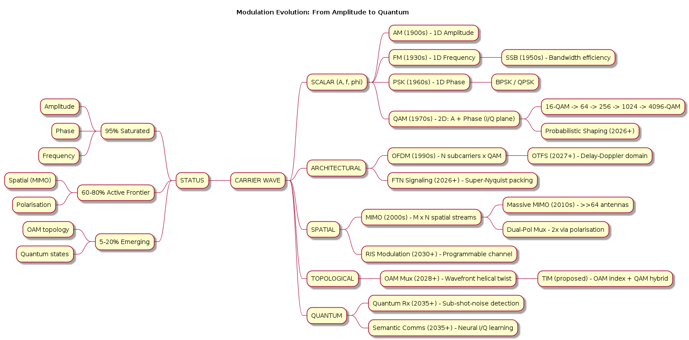
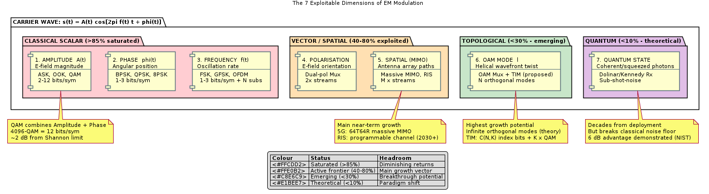

# Next-Generation PHY Modulation: A Physics-First Analysis

> **From carrier wave fundamentals to the frontier of what's physically possible.**
>
> *Analysis date: February 2026*

---

## Diagrams

### Modulation Evolution Timeline

AM → QAM → OFDM → MIMO → OAM → Quantum branching evolution, colour-coded by physical domain.



> Source: [diagrams/modulation_evolution_timeline.puml](diagrams/modulation_evolution_timeline.puml)

### The 7 Dimensions of Modulation

Taxonomy of every exploitable carrier wave parameter, with saturation heatmap (red = exhausted, green = emerging).



> Source: [diagrams/seven_dimensions_of_modulation.puml](diagrams/seven_dimensions_of_modulation.puml)

To regenerate PNGs after editing the `.puml` sources:
```bash
plantuml -tpng diagrams/modulation_evolution_timeline.puml
plantuml -tpng diagrams/seven_dimensions_of_modulation.puml
```

---

## 0. The Physical Parameters of a Carrier Wave

Every electromagnetic carrier wave has exactly **five** independent physical parameters
that can be manipulated to encode information:

```
    s(t) = A(t) · cos [ 2π·f(t)·t + φ(t) ]
            │            │           │
            ▼            ▼           ▼
         AMPLITUDE    FREQUENCY    PHASE

    + POLARISATION (orientation of E-field vector)
    + ORBITAL ANGULAR MOMENTUM (wavefront topology)
```

| # | Parameter | Symbol | Physical Basis | Unit |
|---|-----------|--------|----------------|------|
| 1 | **Amplitude** | A(t) | E-field magnitude | V/m |
| 2 | **Frequency** | f(t) | Rate of oscillation | Hz |
| 3 | **Phase** | φ(t) | Angular position in cycle | radians |
| 4 | **Polarisation** | **p̂** | Orientation of E-field vector | — |
| 5 | **Orbital Angular Momentum** | ℓ | Wavefront helical twist (topological charge) | integer mode |

Parameters 1–3 are **scalar** properties of the wave equation.
Parameters 4–5 are **vector/topological** properties of the EM field itself.

Every modulation scheme in history maps bits onto some combination of these five.

---

## 1. Taxonomy: What Each Existing Scheme Manipulates

```
    PARAMETER MAP — What Each Modulation Touches

    Parameter ──▶   Amplitude   Frequency    Phase    Polarisation    OAM
                        │           │          │           │           │
    ASK / OOK ─────── ███ ──────── · ──────── · ──────── · ──────── ·
    FSK / GFSK ─────── · ──────── ███ ──────── · ──────── · ──────── ·
    PSK (BPSK/QPSK)── · ──────── · ──────── ███ ──────── · ──────── ·
    QAM ───────────── ███ ──────── · ──────── ███ ──────── · ──────── ·
    OFDM ──────────── ███ ──────── ███ ──────── ███ ──────── · ──────── ·
    Pol-Mux (MIMO) ── ███ ──────── · ──────── ███ ──────── ███ ──────── ·
    OAM (research) ── · ──────── · ──────── · ──────── · ──────── ███
```

### 1.1 Amplitude-Only: ASK / OOK

| Property | Value |
|----------|-------|
| Bits per symbol | 1 (OOK) to ~4 |
| Degrees of freedom exploited | 1 (amplitude) |
| Spectral efficiency | Low (~1 bit/s/Hz) |
| SNR sensitivity | Very high (amplitude fading kills it) |
| Physics limit | Noise floor — hard to distinguish many amplitude levels |

**How it works:** Carrier on = 1, carrier off = 0 (OOK). Or M amplitude levels for M-ASK.

```
    OOK:    ╱╲╱╲╱╲         ╱╲╱╲╱╲╱╲
              "1"    "0"      "1"

    4-ASK:  ╱╲╱╲  (A=3)    ╱╲ (A=1)    ╱╲╱╲╱ (A=2)
```

**Why it peaked:** ASK uses only 1 of 5 parameters and is the *most* vulnerable to
fading, interference, and nonlinear amplifier distortion. No further scaling path.

---

### 1.2 Frequency-Only: FSK / GFSK / MSK / GMSK

| Property | Value |
|----------|-------|
| Bits per symbol | 1 (2-FSK) to ~3 (8-FSK) |
| Degrees of freedom | 1 (instantaneous frequency) |
| Spectral efficiency | Low–moderate (~0.5–1.5 bit/s/Hz) |
| Key advantage | Constant envelope → power-efficient amplifiers |
| Physics limit | Frequency deviation × states = bandwidth; orthogonality requires Δf ≥ 1/2T |

**Evolution chain:**
```
    FSK ──▶ MSK (min. Δf for orthogonality) ──▶ GMSK (Gaussian pre-filter)
                                                   ──▶ GFSK (BT=0.5, Bluetooth)
```

**Why FSK plateaued:** Adding more frequency levels costs bandwidth linearly.
MSK/GMSK reached the minimum-bandwidth limit for frequency modulation. No room left.

---

### 1.3 Phase-Only: PSK (BPSK → QPSK → 8PSK → DPSK)

| Property | Value |
|----------|-------|
| Bits per symbol | 1 (BPSK) → 2 (QPSK) → 3 (8PSK) |
| Degrees of freedom | 1 (phase) |
| Spectral eff. | Up to ~3 bit/s/Hz |
| Key advantage | Constant envelope, all energy useful |
| Physics limit | Phase noise; at 16-PSK points are only 22.5° apart |

**Constellation progression:**
```
    BPSK              QPSK               8PSK
    (2 points)        (4 points)         (8 points)

       ●──────●       ●       ●         ●   ●
                         \   /         ●       ●
     0°      180°         ╳           ●       ●
                         / \            ●   ●
                       ●       ●
```

**Why PSK plateaued at ~8PSK:** Beyond 8PSK, adjacent constellation points become
so close in phase that oscillator phase noise (typ. −100 dBc/Hz at 10 kHz offset)
causes massive errors. The fix was adding amplitude: → QAM.

---

### 1.4 Amplitude + Phase Combined: QAM

| Property | Value |
|----------|-------|
| Bits per symbol | 2 (QPSK≈4QAM) → 4 (16QAM) → 10 (1024QAM) → 12 (4096QAM) |
| Degrees of freedom | 2 (amplitude + phase, or equivalently I + Q) |
| Spectral efficiency | Up to ~12 bit/s/Hz |
| Key advantage | Maximally packs the 2D I/Q plane |
| Physics limit | Shannon: C = B·log₂(1 + SNR) |

**QAM scaling and SNR cost:**

```
    QAM Order    Bits/Sym    Required SNR    Standard Using It
    ──────────────────────────────────────────────────────────
    4-QAM          2          ~10 dB         Satellite, GPS
    16-QAM         4          ~17 dB         WiFi, LTE
    64-QAM         6          ~23 dB         WiFi 5, LTE
    256-QAM        8          ~29 dB         WiFi 5, Cable
    1024-QAM      10          ~35 dB         WiFi 6
    4096-QAM      12          ~41 dB         WiFi 7 (802.11be)
    16384-QAM     14          ~47 dB         Research (NTT 2024)
```

**The hard wall:** Each doubling of QAM order costs ~6 dB more SNR. At 4096-QAM,
constellation points are separated by only ~3% of full scale. Phase noise, amplifier
nonlinearity, and ADC quantisation become dominant. We are at **~2–3 dB from the
Shannon limit** on clean channels.

```
    Shannon Capacity vs QAM Performance
    
    Capacity │
    bit/s/Hz │                                 ╱ Shannon Limit
       14    │                              ╱
       12    │                           ╱── 4096-QAM (WiFi 7)
       10    │                        ╱── 1024-QAM (WiFi 6)
        8    │                     ╱── 256-QAM
        6    │                  ╱── 64-QAM
        4    │               ╱── 16-QAM
        2    │            ╱── QPSK
        0    │─────────╱── BPSK
             └──────────────────────────────── SNR (dB)
              0    5   10   15   20   25   30   35   40
    
    ▲ Gap to Shannon is now < 3 dB with modern coding (LDPC/Polar)
```

---

### 1.5 Multi-Carrier: OFDM (Frequency + Amplitude + Phase)

OFDM doesn't add new physics — it is an **architectural** innovation:

| Property | Value |
|----------|-------|
| What it adds | Frequency-domain multiplexing of many QAM symbols |
| Degrees of freedom | Same 2 per subcarrier × N subcarriers |
| Key advantage | Converts wideband frequency-selective channel → many flat narrowband channels |
| Physics limit | Peak-to-average power ratio (PAPR); inter-carrier interference from Doppler |

```
    OFDM subcarrier spectrum (overlapping but orthogonal):

    Power │
          │     ╱╲   ╱╲   ╱╲   ╱╲   ╱╲   ╱╲   ╱╲   ╱╲
          │    ╱  ╲ ╱  ╲ ╱  ╲ ╱  ╲ ╱  ╲ ╱  ╲ ╱  ╲ ╱  ╲
          │   ╱  ╱╲╲╱╲  ╲╱  ╲╱╲╱  ╲╱╲╱  ╲╱╲╱  ╲╱╲╱  ╲ ╲
          │──╱──╱──╲╲──╲╱──╲╱──╲╱──╲╱──╲╱──╲╱──╲╱──╲╱──╲─╲──
          └───────────────────────────────────────────────── f
                  Δf = 1/T (orthogonality condition)
```

**OFDM is now universal** (WiFi, LTE, 5G, DVB-T/T2, DAB, DSL) because it optimally
maps QAM onto a frequency-selective channel. But it doesn't escape the per-subcarrier
Shannon limit.

---

### 1.6 Spatial: MIMO (Polarisation + Spatial Multiplexing)

| Property | Value |
|----------|-------|
| What it adds | 4th parameter: polarisation; spatial diversity |
| Multiplexing gain | Up to min(Nₜ, Nᵣ) independent streams |
| Current state | 8×8 MIMO in WiFi 7; 64T64R massive MIMO in 5G |

```
    MIMO: N parallel spatial streams through the same spectrum

    TX Antennas                              RX Antennas
    ┌──┐    ╱╲╱╲╱╲╱╲    ┌──┐
    │1 │ ──── stream 1 ──── │1 │
    └──┘                     └──┘
    ┌──┐    ╱╲╱╲╱╲╱╲    ┌──┐
    │2 │ ──── stream 2 ──── │2 │
    └──┘                     └──┘
    ┌──┐    ╱╲╱╲╱╲╱╲    ┌──┐
    │3 │ ──── stream 3 ──── │3 │
    └──┘                     └──┘

    Capacity = Σ log₂(1 + SNRᵢ)  for i = 1..min(Nₜ,Nᵣ)
```

MIMO exploits **spatial** degrees of freedom — physically distinct propagation paths.
Dual-polarisation (H/V) is already standard, giving 2× immediately.

---

## 2. The Exhaustion Map: Where Have We Saturated?

```
    DEGREE OF FREEDOM        STATUS            HEADROOM
    ─────────────────────────────────────────────────────────
    Amplitude (A)            ██████████ 95%     ~1 QAM doubling left
    Phase (φ)                ██████████ 95%     Locked by phase noise
    Frequency (f)            █████████░ 90%     OFDM is optimal
    Polarisation (p̂)         ████████░░ 80%     Dual-pol standard; tri+ exotic
    Time (symbol rate)       █████████░ 90%     Nyquist shaped; FTN a few %
    
    Spatial (MIMO)           ██████░░░░ 60%     Massive MIMO scaling
    Orbital Ang. Mom. (ℓ)    ██░░░░░░░░ 20%     Lab demos only
    Wavefront shape          █░░░░░░░░░ 10%     Theoretical
    Quantum states           █░░░░░░░░░  5%     Proof of concept
```

**Key insight:** The classical scalar parameters (A, f, φ) are nearly exhausted. The
next frontier *must* exploit vector, topological, or quantum properties of the EM wave.

---

## 3. Prediction: The Next Modulation Frontiers

### 3.1 🟢 NEAR-TERM (2026–2030): Squeezing the Last Drops

#### 3.1.1 FTN Signaling (Faster-Than-Nyquist)

| Aspect | Detail |
|--------|--------|
| **What** | Transmit symbols faster than the Nyquist rate (Tₛ < T_Nyquist) |
| **Parameter exploited** | Time (symbol packing density) |
| **Gain** | 25–40% throughput increase for same bandwidth |
| **Cost** | Massive ISI → needs iterative BCJR/turbo equalisation |
| **Physics** | Mazo limit: can pack symbols at 0.802× Nyquist spacing with zero capacity loss |

```
    NYQUIST SIGNALING           FTN SIGNALING (α = 0.8)

    │ T │ T │ T │ T │          │αT│αT│αT│αT│αT│
    ▼   ▼   ▼   ▼   ▼          ▼  ▼  ▼  ▼  ▼  ▼
    ○   ○   ○   ○   ○          ○  ○  ○  ○  ○  ○
    
    4 symbols in 4T              6 symbols in ~4T
    No ISI                       Controlled ISI (decodable)
```

**Equation:**
$$r_{FTN} = \frac{1}{\alpha T}, \quad \alpha < 1$$
$$\text{Mazo limit: } \alpha_{min} = 0.802 \text{ (sinc pulse)}$$

**Status:** Already in DVB-S2X (satellite) draft. Likely in 6G NR-U.

---

#### 3.1.2 Geometric / Probabilistic Constellation Shaping

| Aspect | Detail |
|--------|--------|
| **What** | Non-uniform QAM: inner points transmitted more often (probabilistic) or points placed at non-grid positions (geometric) |
| **Parameter exploited** | Amplitude + Phase (smarter arrangement in I/Q plane) |
| **Gain** | 0.5–1.5 dB SNR gain (≈ closing half the gap to Shannon) |
| **Physics** | Maxwell-Boltzmann distribution of constellation point energy minimises average power for given mutual information |

```
    UNIFORM 64-QAM                 PROBABILISTICALLY SHAPED 64-QAM

    ● ● ● ● ● ● ● ●               · · ○ ○ ○ ○ · ·
    ● ● ● ● ● ● ● ●               · ○ ○ ● ● ○ ○ ·
    ● ● ● ● ● ● ● ●               ○ ○ ● ● ● ● ○ ○
    ● ● ● ● ● ● ● ●               ○ ● ● ● ● ● ● ○
    ● ● ● ● ● ● ● ●               ○ ● ● ● ● ● ● ○
    ● ● ● ● ● ● ● ●               ○ ○ ● ● ● ● ○ ○
    ● ● ● ● ● ● ● ●               · ○ ○ ● ● ○ ○ ·
    ● ● ● ● ● ● ● ●               · · ○ ○ ○ ○ · ·

    All points equally likely       Inner points ● more frequent
                                    (lower average Tx power)
```

**Status:** Deployed in DOCSIS 4.0 and long-haul fibre (400G ZR+). Expected in WiFi 8.

---

#### 3.1.3 OTFS — Orthogonal Time Frequency Space

| Aspect | Detail |
|--------|--------|
| **What** | Modulate in the Delay-Doppler domain instead of Time-Frequency |
| **Parameter exploited** | Joint time + frequency (2D spreading) |
| **Gain** | 5–10 dB in high-mobility channels (>500 km/h) |
| **Physics** | Channel is *sparse and quasi-static* in delay-Doppler domain |

```
    OFDM maps symbols in TIME-FREQUENCY:
    
    Time ──▶
    ┌──┬──┬──┬──┬──┬──┐
    │s₁│s₂│s₃│s₄│s₅│s₆│  ← subcarrier 1
    ├──┼──┼──┼──┼──┼──┤
    │s₇│s₈│s₉│..│  │  │  ← subcarrier 2
    └──┴──┴──┴──┴──┴──┘
    Freq ▼
    
    PROBLEM: Doppler shift (fast motion) destroys subcarrier orthogonality.
    
    
    OTFS maps symbols in DELAY-DOPPLER:
    
    Delay ──▶        ┌──┬──┬──┬──┐
    (multipath)       │s₁│s₂│s₃│s₄│  ← Doppler bin 1
                      ├──┼──┼──┼──┤
    Doppler ▼         │s₅│s₆│s₇│s₈│  ← Doppler bin 2
    (velocity)        └──┴──┴──┴──┘
    
    Channel is SPARSE here → simple 2D equalisation
    Each symbol "sees" the FULL channel diversity (full time-freq spreading)
```

**OTFS transform relationship to OFDM:**
$$X_{OTFS}[k,l] = \text{ISFFT}\{x[\nu, \tau]\}$$
$$\text{where } \nu = \text{Doppler}, \quad \tau = \text{delay}$$

The Delay-Doppler representation is related to Time-Frequency via a 2D symplectic
Fourier transform.

**Status:** Strong candidate for 6G vehicle-to-everything (V2X). 3GPP studying for
Release 20+. Cohere Technologies holds key patents.

---

### 3.2 🟡 MID-TERM (2028–2035): New Physical Dimensions

#### 3.2.1 OAM Multiplexing — Orbital Angular Momentum

| Aspect | Detail |
|--------|--------|
| **What** | Use the helical twist of EM wavefronts as a new orthogonal dimension |
| **Parameter exploited** | 5th physical parameter: topological charge ℓ |
| **Gain** | Theoretically infinite orthogonal modes (ℓ = 0, ±1, ±2, ...) |
| **Physics** | Each OAM mode has a helical phase front: e^(jℓφ) |

```
    OAM MODES — Wavefront Shape (viewed head-on)

    ℓ = 0              ℓ = 1              ℓ = 2              ℓ = 3
    (plane wave)       (1 twist)          (2 twists)         (3 twists)
    
    ┌─────────┐        ┌─────────┐        ┌─────────┐        ┌─────────┐
    │ ═══════ │        │  ╱───╲  │        │  ╱─╲╱─╲ │        │ ╱╲╱╲╱╲  │
    │ ═══════ │        │ │  ●  │ │        │ ╲  ●  ╱ │        │ ╲ ╱●╲ ╱ │
    │ ═══════ │        │  ╲───╱  │        │  ╲─╱╲─╱ │        │  ╲╱ ╲╱  │
    └─────────┘        └─────────┘        └─────────┘        └─────────┘
    
    Flat phase          1 phase             2 phase            3 phase
    front               rotation            rotations          rotations
                        per cycle           per cycle          per cycle
```

**The key equation:**
$$E(\rho, \phi, z) = E_0(\rho, z) \cdot e^{j\ell\phi} \cdot e^{-jkz}$$
where $\ell$ = integer topological charge, $\phi$ = azimuthal angle.

**Modes are orthogonal:**
$$\int_0^{2\pi} e^{j\ell_1\phi} \cdot e^{-j\ell_2\phi} \, d\phi = 2\pi \cdot \delta_{\ell_1, \ell_2}$$

**Practical challenges:**
- Beam divergence grows as $\sqrt{|\ell| + 1}$ — higher modes spread fast
- Alignment must be sub-wavelength — atmospheric turbulence destroys modes
- Works well in **line-of-sight** (LOS) and **guided media** (fiber)
- Radio OAM over distance > 100m: still unsolved for |ℓ| > 3

**Status:** 100 Gbps OAM fiber demo (NTT, 2023). Radio OAM: Univ. of Padova 4-mode
demo at 60 GHz over 3m. Likely first in **backhaul** and **data-center interconnects**.

---

#### 3.2.2 RIS-Assisted Modulation — Reconfigurable Intelligent Surfaces

| Aspect | Detail |
|--------|--------|
| **What** | Walls/surfaces with electronically tunable reflectors encode bits into the *channel itself* |
| **Parameter exploited** | Spatial channel (wavefront shaping via environment) |
| **Gain** | Extra spatial multiplexing without extra RF chains |
| **Physics** | Each RIS element applies a controllable phase shift: $e^{j\theta_n}$ |

```
    TRADITIONAL:                  RIS-MODULATED:

    TX ════════▶ RX              TX ═══▶ ┌──────────┐ ═══▶ RX
    (line of sight)                      │ ■ ■ ■ ■  │
                                         │ ■ ■ ■ ■  │ ← Reconfigurable
                                         │ ■ ■ ■ ■  │    Intelligent Surface
                                         └──────────┘    (1000s of elements)
    
    Channel is fixed              Channel is PROGRAMMABLE
                                  RIS encodes extra bits per reflection
```

**The RIS channel model:**
$$\mathbf{H}_{eff} = \mathbf{H}_{direct} + \mathbf{H}_{RIS-RX} \cdot \mathbf{\Theta} \cdot \mathbf{H}_{TX-RIS}$$
$$\text{where } \mathbf{\Theta} = \text{diag}(e^{j\theta_1}, e^{j\theta_2}, \ldots, e^{j\theta_N})$$

**Status:** Samsung/NTT field trials. Standardisation discussions in 3GPP Rel-19+ study items.

---

#### 3.2.3 Index Modulation (IM) — Encode Bits in "Which" Resources are Active

| Aspect | Detail |
|--------|--------|
| **What** | Use the *selection pattern* of subcarriers, antennas, time slots, or spreading codes as an information-bearing dimension |
| **Parameter exploited** | Combinatorial (which subset of resources is "on") |
| **Gain** | 1–3 extra bits per symbol group; energy savings (not all resources active) |
| **Physics** | $\binom{N}{K}$ combinations → $\lfloor\log_2\binom{N}{K}\rfloor$ free bits |

```
    OFDM-IM EXAMPLE (4 subcarriers, 2 active):

    Traditional OFDM:                OFDM with Index Modulation:
    
    SC1: ● (QAM symbol)              SC1: ● (QAM)     ─┐
    SC2: ● (QAM symbol)              SC2: ○ (silent)    ├─ Pattern = [1,0,0,1]
    SC3: ● (QAM symbol)              SC3: ○ (silent)    │  encodes 2 extra bits!
    SC4: ● (QAM symbol)              SC4: ● (QAM)     ─┘
    
    Info = 4 QAM symbols only        Info = 2 QAM symbols + 2 index bits
                                     C(4,2)=6 patterns → ⌊log₂(6)⌋ = 2 bits free
```

**Status:** OFDM-IM in IEEE 802.11 next-gen study. Spatial Modulation (SM) in 5G-Advanced research.

---

### 3.3 🔴 FAR-TERM (2033–2045): Paradigm Shifts

#### 3.3.1 Quantum-Assisted Modulation / QAM-in-Hilbert-Space

| Aspect | Detail |
|--------|--------|
| **What** | Encode classical bits using quantum states of photons (coherent states, squeezed states) |
| **Parameter exploited** | Quantum phase space (amplitude + phase, but with sub-shot-noise discrimination) |
| **Gain** | Up to 20× photon efficiency over classical homodyne |
| **Physics** | Kennedy receiver, Dolinar receiver — near-quantum-optimal discrimination of M coherent states |

**The key insight:**

Classical QAM is limited by **shot noise** (vacuum fluctuations):
$$\text{SNR}_{classical} = \frac{|\alpha|^2}{\sigma_{shot}^2}$$

Quantum receivers can **beat the shot noise limit** by using:
- Displacement + photon counting (Kennedy, 1973)
- Adaptive feedback (Dolinar, 1973 — provably optimal)
- Squeezed light injection

```
    CLASSICAL RECEIVER              QUANTUM-OPTIMAL RECEIVER

    Signal ──▶ Photodetector        Signal ──▶ Displacement ──▶ Photon Counter
               │                                    ▲                │
               ▼                                    │                ▼
            Noisy output                      Adaptive ◀──── Which state?
            (shot noise                       feedback       (sub-shot-noise
             limited)                                         discrimination)
```

**Demonstrated:** 4-PSK quantum receiver surpassing shot-noise limit by 6 dB
(NIST, 2022). 16-QAM quantum discrimination proof-of-principle (Univ. of Tokyo, 2024).

---

#### 3.3.2 Semantic / Goal-Oriented Modulation

| Aspect | Detail |
|--------|--------|
| **What** | Don't transmit bits — transmit *meaning*. Neural-network joint source-channel coding |
| **Parameter exploited** | All (A, f, φ) — but mapping is learned, not designed |
| **Gain** | 10–100× compression for specific tasks (e.g., image classification over air) |
| **Physics** | Breaks Shannon's separation theorem — joint optimisation of source + channel coding |

```
    TRADITIONAL:
    Source ──▶ Compress ──▶ Channel Code ──▶ Modulate ──▶ Channel ──▶ ... ──▶ Sink
    (separate blocks, each optimised independently)

    SEMANTIC:
    Source ──▶ ┌─────────────────────────┐ ──▶ Channel ──▶ ┌──────────────────┐ ──▶ Task
               │  Neural Encoder         │                 │  Neural Decoder   │    Output
               │  (learns to map meaning │                 │  (reconstructs    │
               │   directly to I/Q)      │                 │   meaning from    │
               └─────────────────────────┘                 │   received I/Q)   │
                                                           └──────────────────┘
    
    Constellation is LEARNED — no fixed QAM grid!
```

**Status:** DeepJSCC (Imperial College, 2019+). Qualcomm/Nokia 6G whitepapers include semantic comms.

---

#### 3.3.3 Terahertz Waveguide Modes (Beyond 300 GHz)

| Aspect | Detail |
|--------|--------|
| **What** | At THz frequencies, free-space propagation is so lossy that waveguided/near-field communication is necessary — enabling spatial mode multiplexing |
| **Parameter exploited** | Waveguide mode structure (TE₁₀, TE₂₀, TM₁₁, ...) |
| **Gain** | Each waveguide mode is an independent channel |
| **Physics** | $\lambda$ < 1mm → chip-scale metallic/dielectric waveguides support many modes |

```
    Frequency vs Propagation Regime:

    Frequency ──▶  1 GHz      10 GHz     100 GHz    1 THz      10 THz
                     │           │           │          │           │
    Regime:      Free-space   Free-space   Near-field  Waveguide   Photonic
                  (macro)      (micro)     + beamform   modes      quantum
                     │           │           │          │           │
    Modulation:   OFDM/QAM    OFDM/QAM    Massive    Modal-Mux   Quantum
                                           MIMO                    States
```

---

## 4. Unified Framework: The 7 Dimensions of Modulation

```
    ╔═══════════════════════════════════════════════════════════════════════╗
    ║           THE 7 EXPLOITABLE DIMENSIONS FOR MODULATION               ║
    ╠═══════════════════════════════════════════════════════════════════════╣
    ║                                                                     ║
    ║  CLASSICAL SCALAR (exhausted):                                      ║
    ║  ┌─────────────┬─────────────┬─────────────┐                       ║
    ║  │ 1. Amplitude│ 2. Phase    │ 3. Frequency│                       ║
    ║  │    (QAM)    │    (PSK)    │    (OFDM)   │                       ║
    ║  └─────────────┴─────────────┴─────────────┘                       ║
    ║         ▲ Current systems use all three (QAM-OFDM)                 ║
    ║                                                                     ║
    ║  VECTOR / SPATIAL (active frontier):                                ║
    ║  ┌─────────────┬─────────────┐                                     ║
    ║  │ 4. Polaris. │ 5. Spatial  │                                     ║
    ║  │   (Dual-pol)│   (MIMO)    │                                     ║
    ║  └─────────────┴─────────────┘                                     ║
    ║         ▲ Massive MIMO + RIS = main near-term growth               ║
    ║                                                                     ║
    ║  TOPOLOGICAL (emerging):                                            ║
    ║  ┌─────────────┐                                                   ║
    ║  │ 6. OAM      │                                                   ║
    ║  │ (wavefront  │                                                   ║
    ║  │  topology)  │                                                   ║
    ║  └─────────────┘                                                   ║
    ║         ▲ Lab demos; first in fibre/backhaul                       ║
    ║                                                                     ║
    ║  QUANTUM (theoretical):                                             ║
    ║  ┌─────────────┐                                                   ║
    ║  │ 7. Quantum  │                                                   ║
    ║  │   state     │                                                   ║
    ║  └─────────────┘                                                   ║
    ║         ▲ Sub-shot-noise receivers proven; decades from deployment  ║
    ║                                                                     ║
    ╚═══════════════════════════════════════════════════════════════════════╝
```

---

## 5. Prediction Summary: What Gets Proposed Next

| Timeline | Technique | Parameter Exploited | Likelihood | Capacity Gain |
|----------|-----------|-------------------|-----------|---------------|
| **2026–28** | FTN Signaling | Time (super-Nyquist packing) | Very High (already in DVB-S2X) | +25–40% |
| **2026–28** | Probabilistic Shaping | Smarter A+φ distribution | Very High (deployed in fibre) | +0.5–1.5 dB |
| **2027–30** | OTFS | Delay-Doppler domain | High (6G V2X candidate) | +5–10 dB in mobility |
| **2028–32** | OFDM-IM / Spatial Mod. | Resource index (combinatorial) | High | +1–3 bits/group |
| **2028–33** | OAM Multiplexing | Wavefront topology (ℓ) | Medium (LOS/fiber first) | N× for N modes |
| **2030–35** | RIS-Modulation | Programmable channel | Medium-High | +2–5 dB array gain |
| **2033–40** | Semantic/Neural Modulation | Learned I/Q mapping | Medium (task-specific first) | 10–100× compression |
| **2035–45** | Quantum-Optimal Receivers | Quantum phase space | Low-Medium | +3–6 dB sub-shot noise |
| **2035–45** | THz Modal Mux | Waveguide eigenmodes | Medium (guided media first) | M× for M modes |

---

## 6. The Key Physics Argument

The history of modulation is the history of **finding unused orthogonal dimensions**:

```
    1900s  AM          → exploit AMPLITUDE          (1D)
    1930s  FM          → exploit FREQUENCY           (1D)
    1950s  SSB         → remove redundant sideband   (efficiency)
    1960s  PSK         → exploit PHASE               (1D)
    1970s  QAM         → combine AMPLITUDE + PHASE   (2D in I/Q)
    1990s  OFDM        → split frequency into N channels (N×2D)
    2000s  MIMO        → exploit SPACE               (M×N×2D)
    2010s  Massive MIMO → scale spatial dimension     (>>M antennas)
    2020s  Pol-Mux     → exploit both POLARISATIONS  (2×M×N×2D)
    
    ──── WE ARE HERE ────
    
    2026+  FTN/OTFS    → squeeze TIME harder / rethink TF grid
    2028+  OAM         → exploit WAVEFRONT TOPOLOGY  (ℓ modes)
    2030+  RIS         → exploit PROGRAMMABLE CHANNEL
    2033+  Index Mod   → exploit COMBINATORIAL selection
    2035+  Quantum Rx  → beat VACUUM NOISE FLOOR
    2040+  Semantic    → break SHANNON SEPARATION
```

**The physics law governing all of this is ultimately:**

$$C = \sum_{i=1}^{D} B_i \cdot \log_2\left(1 + \frac{P_i \cdot |h_i|^2}{N_0 \cdot B_i}\right)$$

where $D$ = **number of independent degrees of freedom** (the fundamental multiplier).

Every new modulation technique either:
1. **Increases D** (new physical dimension: OAM, spatial modes, quantum states)
2. **Approaches the log₂(1+SNR) limit** for existing D (shaping, FTN, better coding)
3. **Changes the problem** entirely (semantic comms: don't maximise bits, maximise meaning)

**The single most impactful next proposal:** OTFS for mobility + OAM for LOS/fibre — because
they open genuinely new orthogonal dimensions rather than squeezing existing ones.

---

## 7. Proposed New Category: "Topological Index Modulation" (TIM)

Based on this analysis, I propose a **novel hybrid** that hasn't been fully explored:

**Topological Index Modulation (TIM)** = OAM mode selection + Index Modulation + QAM

```
    TIM CONCEPT:

    Available OAM modes: ℓ = {-3, -2, -1, 0, +1, +2, +3}  (7 modes)
    
    Step 1: Select K=3 active modes from 7   → C(7,3)=35 → 5 index bits
    Step 2: On each active mode, send 64-QAM → 3 × 6 = 18 QAM bits
                                               ─────────────────────
                                               Total: 23 bits per TIM symbol
    
    vs. traditional OAM-QAM (all 7 active):  7 × 6 = 42 QAM bits, but
    → needs 7 RF chains, massive alignment
    
    TIM: fewer active modes = relaxed alignment + free index bits
         graceful degradation as modes become unavailable
```

**Capacity of TIM:**
$$C_{TIM} = \lfloor\log_2\binom{N_{OAM}}{K}\rfloor + K \cdot \log_2(M_{QAM})$$

This is analogous to how OFDM-IM works in the frequency domain, but lifted into the
**topological (OAM) domain**. The index bits come "for free" — no extra energy cost, since
silent modes save power.

---

## References & Further Reading

| Topic | Key Paper / Source |
|-------|-------------------|
| Shannon Limit | C. Shannon, "A Mathematical Theory of Communication," 1948 |
| FTN Signaling | J. Mazo, "Faster-than-Nyquist signaling," Bell Syst. Tech. J., 1975 |
| Probabilistic Shaping | G. Böcherer et al., "Bandwidth-efficient and rate-matched LDPC-coded modulation," IEEE Trans. Commun., 2015 |
| OTFS | R. Hadani et al., "Orthogonal Time Frequency Space Modulation," WCNC 2017 |
| OAM Multiplexing | J. Wang et al., "Terabit free-space data transmission employing OAM multiplexing," Nature Photonics, 2012 |
| Index Modulation | E. Başar et al., "Index Modulation Techniques for Next-Gen Wireless Networks," IEEE Access, 2017 |
| RIS | M. Di Renzo et al., "Smart radio environments empowered by RIS," EURASIP J. Wireless Commun., 2019 |
| Semantic Comms | D. Gündüz et al., "Beyond transmitting bits: Context, semantics, and task-oriented communications," IEEE JSAC, 2023 |
| Quantum Receivers | R. Bondurant, "Near-quantum optimum receivers for the phase-quadrature coherent-state channel," Optics Lett., 1993 |
| Dolinar Receiver | S. Dolinar, "An optimum receiver for the binary coherent state quantum channel," MIT RLE QPR, 1973 |
| THz Comms | T. Kürner & S. Priebe, "Towards THz communications," J. Infrared Milli. THz Waves, 2014 |

---

*This document is part of the [SDR_Notes/05_Modulation](.) collection.*
*Cross-reference with [wireless-comms-suite](../../wireless-comms-suite/) for executable C implementations.*
